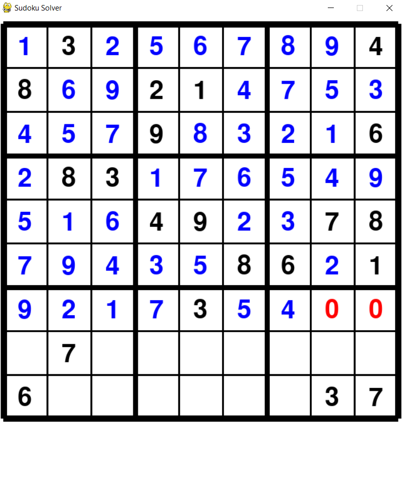
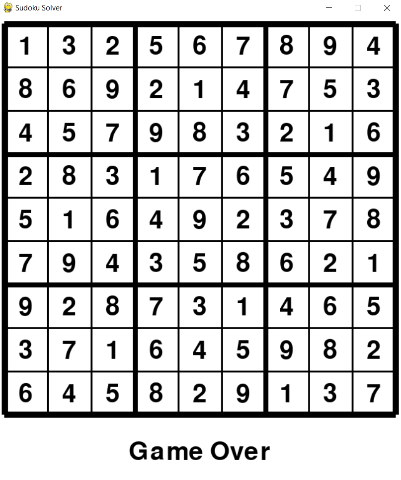

# PyDoku
An app to solve Sudoku Puzzles

## Task:
Create a Sudoku board and use backtracking to solve it

## Criteria:
* Stick to the rules of Sudoku
* Offer a randomized table that differs each time it is run
* Provide a GUI for the user
* Display graphics in order for algorithm to be visualized

## How to Use App
1. After files are downloaded, the user should run "pip install pygame" in the command line. If you still get an error message, then go to Python Packages page. Search Pygame in the
search bar and click on “install with pip” button.
2. Make sure to run the Menu.py to start the pygame executable.
3. Click on the "Start" button to go to the empty board.
4. Press the "Solve" button to run the CSP algorithm.
5. Once puzzle is solved, the numbers will turn black and the app can be exited using the "Quit" Button.

* The "Menu" button takes the user back to the start screen
* The "Reset" button generates a new empty board and replaces the current board with it.

### Prototype #1:
Implemented the backtracking in order to solve the puzzle in the console.

### Prototype #2:
Included a GUI that only displays the partially filled sudoku board.

### Prototype 3:
Project is visually pleasing with updated GUI. Below are some examples of how the app works.

Partially solved:

Completely solved:

### Prototype 3:
Revised the project for an Intro to AI course. The method of solving is now a constraint-satisfaction-problem with alldifferent constraints. Now solving times are greatly reduced. Also a menu system and new buttons were added to the GUI.

